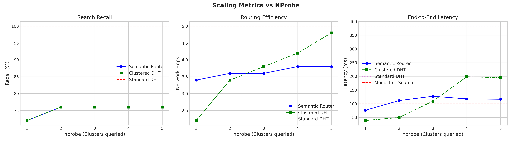
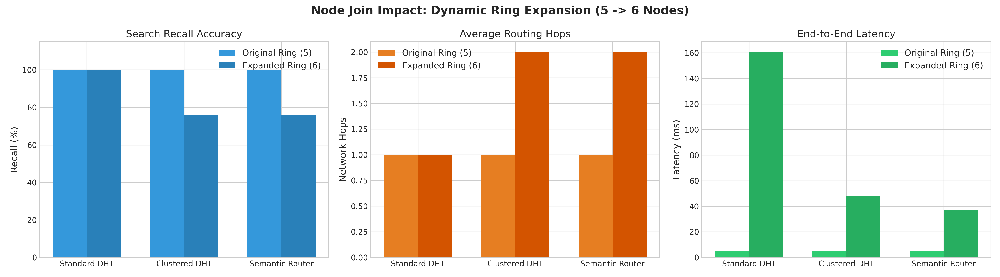
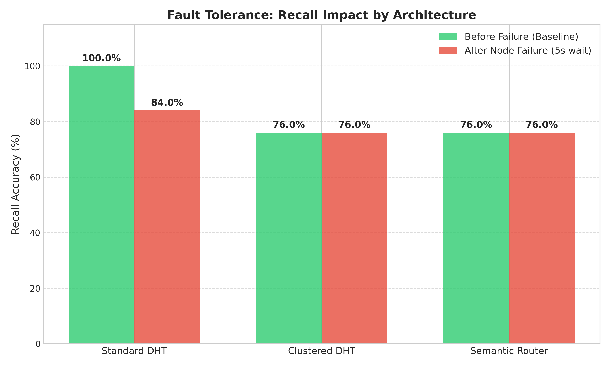

# Decentralized Vector Database (P2P Semantic Router)

This project is a Proof of Concept (v1.0) for a highly scalable, decentralized Vector Database. It marries the robust peer-to-peer architecture of a **Chord Distributed Hash Table (DHT)** with the mathematical precision of **Semantic Vector Search (KNN)**.

Unlike traditional categorical DHTs that rely on random SHA-1 hashing, this architecture mathematically maps K-Means semantic clusters across the circular ring. This ensures that semantically similar data is hosted in identical or adjacent network regions, enabling powerful distributed fanout queries.

## 📂 Directory Layout

```text
├── data/                      # Database and results storage
│   ├── benchmarks/            # Evaluation results and documentation
│   │   ├── plots/             # Rendered charts (PNG)
│   │   │   ├── local/         # Local simulation plots
│   │   │   └── containerized/ # Containerized cluster plots
│   │   ├── results/           # Raw collected metrics (JSON)
│   │   │   ├── local/         # Local simulation JSON results
│   │   │   └── containerized/ # Containerized cluster JSON results
│   │   └── README.md          # Benchmark results analysis report
│   ├── models/                # Trained K-Means centroids and TF-IDF artifacts
│   └── raw/                   # Udemy Kaggle CSV dataset and normalized JSON payloads
├── src/                       # Database source code
│   ├── architectures/         # Database topologies
│   │   ├── monolithic_linear/ # Centralized exhaustive KNN baseline
│   │   ├── standard_dht/      # Standard random-hash Chord DHT ring
│   │   ├── clustered_dht/     # Hashed K-Means clusters DHT ring
│   │   └── semantic_router/   # Mapped Agglomerative semantic Chord ring (Proposed)
│   ├── benchmarks/            # Scalability, fault-tolerance, and load-balancing benchmarks
│   │   ├── local/             # Local simulation evaluation scripts
│   │   ├── containerized/     # Containerized cluster evaluation scripts
│   │   └── metrics.py         # Shared evaluation metrics library
│   ├── core/                  # Decoupled config loader and shared core utilities
│   ├── ml/                    # ML clustering and vocabulary training pipeline
│   └── scripts/               # Kaggle csv normalizer and synthetic course generators
├── local_simulation/          # Local Threaded Simulation environment configuration & scripts
│   ├── run_simulation.py      # Simulation runner (scenario CLI)
│   └── config.local.yaml      # Configuration for local simulation run
├── containerized_environment/ # Distributed Containerized environment configuration & files
│   ├── Dockerfile             # Node container definition
│   ├── docker-compose.yml     # Distributed cluster setup and client runner
│   ├── app.py                 # Node service launcher
│   └── config.prod.yaml       # Configuration for Docker production run
├── config.yaml                # Decoupled network and database parameters file
└── README.md                  # Main project overview and run instructions
```

## 🏗️ Approaches Implemented

This repository implements and compares four different architectural approaches to Vector Search:

1. **Monolithic Linear Search (`src/architectures/monolithic_linear/`):** A centralized baseline that performs an exhaustive linear scan (exact KNN) over all vectors. Provides perfect recall but scales poorly as $O(N)$.
2. **Standard DHT (`src/architectures/standard_dht/`):** A standard Chord DHT implementation where vectors are distributed using random SHA-1 hashing. Provides highly scalable storage, but similarity queries are inefficient as they require broadcasting to all nodes because semantic locality is lost.
3. **Clustered DHT (`src/architectures/clustered_dht/`):** A hybrid baseline where data is grouped via K-Means, but the clusters are placed on the ring using random SHA-1 hashing rather than semantic geometric mapping. 
4. **P2P Semantic Router (`src/architectures/semantic_router/`):** The novel approach where the DHT ring is mathematically partitioned using K-Means centroids. Data is routed based on semantic similarity rather than random hashes, allowing for $O(1)$ routing to the correct cluster and distributed `nprobe` fanout for similarity searches.

---

## 🔑 Key Architectural Features

1. **Semantic Centroid Routing:** Nodes automatically vectorize raw text using TF-IDF and route the data to the correct cluster ID on the DHT ring.
2. **True Vector Embeddings:** Text is vectorized exactly _once_ during insertion (`PUT`), avoiding heavy $O(N)$ text-processing bottlenecks during queries.
3. **`nprobe` Distributed Fanout:** Similarity queries (`GET`) can seamlessly branch out across multiple mathematical clusters simultaneously to merge results, allowing a dynamic trade-off between speed and recall.
4. **Active Replica Load Balancing:** Solves the notorious "Hot Spot" CPU problem. If a node detects high query load, it mathematically delegates the read queries to its replica node, doubling the read capacity of the network without any data migration!
5. **Self-Healing Fault Tolerance:** Standard Chord stabilization protocols ensure that if a Primary node crashes, the Replica node instantly promotes its backup data to Primary.

---

## 🚀 Setup Instructions

This project requires a standard Python environment (Python 3.8+ recommended).

### 1. Create a Virtual Environment (Recommended)

```bash
python3 -m venv .venv
source .venv/bin/activate
```

### 2. Install Dependencies

```bash
pip install -r requirements.txt
```

### 3. Configuration

The system parameters are fully decoupled from the code. You must create a local configuration file before running anything:

```bash
cp config.yaml.example config.yaml
```

_(You can open `config.yaml` to modify the number of nodes, replication factor (RF), ports, and dataset paths)._

---

## 🧠 Dataset Creation & ML Training Pipeline

Before running any simulations, the nodes need mathematical centroids to perform semantic routing. The dataset and models will be cleanly saved to the `data/` directory.

**Step 1: Generate the Raw Dataset**
Generate synthetic courses to populate `data/raw/data.json`. The number of courses is defined in `config.yaml` (`num_courses`).
```bash
python3 src/scripts/generate_synthetic_data.py
```

**Step 2: Train the Semantic K-Means Centroids**
This script parses the raw dataset, builds a TF-IDF vocabulary, and trains the semantic clusters. The resulting `centroids.json` is saved in `data/models/` so the DHT nodes can use it for $O(1)$ routing.
```bash
python3 src/ml/train_centroids.py
```

---

## 🧪 Running the Simulations

The local threaded simulation environment runs multiple ChordNode instances inside the same Python process on loopback IP (`127.0.0.1`) separated by ports. All local simulations are consolidated into a clean CLI interface.

To run the local simulation scenarios, execute the following from the project root:

*   **Scenario 1: Semantic Routing & KNN**
    Proves the non-random ring mapping and the distributed Cosine Similarity search:
    ```bash
    python3 local_simulation/run_simulation.py --scenario routing
    ```

*   **Scenario 2: Fault Tolerance & Self-Healing**
    Simulates node crashes, proving that replication recovery and successor healing work:
    ```bash
    python3 local_simulation/run_simulation.py --scenario failure
    ```

*   **Scenario 3: Replica CPU Load Balancing**
    Blasts a specific node with concurrent queries, proving active replica delegation:
    ```bash
    python3 local_simulation/run_simulation.py --scenario load_balancing
    ```

*   **Scenario 4: Dynamic Node Join**
    Joins a new node to the active network, proving automatic data migration:
    ```bash
    python3 local_simulation/run_simulation.py --scenario join
    ```

*   **Boot Network Only:**
    Boots up the network and keeps it active for manual XML-RPC queries:
    ```bash
    python3 local_simulation/run_simulation.py --scenario boot
    ```

---

## 🐳 Running in Containerized Environment (Docker)

To test the P2P Vector Database under real network isolation, isolated Dockerized cluster configurations are provided under separate folders in `containerized_environment/`. 

Each directory contains its own `docker-compose.yml` file, which spins up a dedicated cluster and automatically sets up an isolated Docker bridge network (e.g. `standard_dht_default`, `semantic_router_default`), ensuring complete routing isolation between architecture tests.

### 1. Build Node Container Image
You can build the shared `p2p-semantic-router` Docker image from any of the folders:
```bash
cd containerized_environment/semantic_router
docker compose build
```

### 2. Orchestrate Distributed Clusters (By Architecture)
Navigate to the targeted subfolder and launch the 5-node Chord ring (1 bootstrap node, 4 worker nodes) in the background:

*   **Standard Chord DHT (Random Hashing):**
    ```bash
    cd containerized_environment/standard_dht
    docker compose up -d
    ```
*   **Clustered Chord DHT (K-Means Hashing):**
    ```bash
    cd containerized_environment/clustered_dht
    docker compose up -d
    ```
*   **Semantic Router Chord DHT (Proposed):**
    ```bash
    cd containerized_environment/semantic_router
    docker compose up -d
    ```

### 3. Tear Down Cluster
Stop and clean up containers and networks inside the respective folder:
```bash
docker compose down
```

---

## 📊 Benchmarks & Results

This project supports running comprehensive benchmarking suites in both the **local threaded simulation** and the **containerized Docker environment**. The results for each run are isolated into separate folders.

### 1. Local Threaded Evaluation
Run evaluations and generate plots for the local loopback DHT ring:

*   **Execute all local benchmarks:**
    ```bash
    python3 -m src.benchmarks.local.evaluate --mode all
    ```
*   **Execute specific modes (scale / fault / join / load):**
    ```bash
    python3 -m src.benchmarks.local.evaluate --mode scale --dataset_size 2000
    ```
*   **Generate Local Charts:**
    ```bash
    python3 -m src.benchmarks.local.plot
    ```
    _Outputs are saved to `data/benchmarks/results/local/` and `data/benchmarks/plots/local/`._

### 2. Containerized Cluster Evaluation
Ensure the cluster nodes for your target architecture are active, then run evaluations inside its distinct runner container:

*   **Run Standard Chord DHT Benchmarks:**
    ```bash
    cd containerized_environment/standard_dht
    docker compose run standard-runner
    ```
*   **Run Clustered Chord DHT Benchmarks:**
    ```bash
    cd containerized_environment/clustered_dht
    docker compose run clustered-runner
    ```
*   **Run Semantic Router Chord DHT Benchmarks:**
    ```bash
    cd containerized_environment/semantic_router
    docker compose run semantic-runner
    ```
*   **Generate Containerized Comparison Charts:**
    Once you run evaluations for one or more architectures, run the plotter script inside any runner to overlay the curves:
    ```bash
    cd containerized_environment/semantic_router
    docker compose run --entrypoint "python -m src.benchmarks.containerized.plot" semantic-runner
    ```
    _Outputs are automatically written back to your host machine in `data/benchmarks/results/containerized/` and `data/benchmarks/plots/containerized/`._

### Metrics Measured:
- **Search Recall:** Accuracy compared to a monolithic exact-KNN baseline.
- **Network Hops:** Average routing hops and semantic cluster mapping efficiency.
- **End-to-End Latency:** Search latency scaling advantages under concurrent query workloads.
- **Healing & Migration Speed:** Duration (in seconds) for rings to heal after node crashes and migrate primary keys on node joins.

**Please view the README in [`data/benchmarks/README.md`](data/benchmarks/README.md) for a full, visual analysis of the local evaluation findings!**

---

## 🏆 Key Containerized Benchmark Findings

The following plots represent the final "apples-to-apples" comparison of all three architectures running in fully isolated Docker container networks. 

### 1. Scaling Metrics (nprobe vs Hops & Latency)
Demonstrates how the **Semantic Router** maintains flat $O(1)$ routing hops as the search radius expands, while the **Clustered DHT** suffers linear hop growth due to randomized hash scatter.


### 2. Network Expansion (Dynamic Node Joins)
Demonstrates the impact of dynamically scaling the network from 5 nodes to 6 nodes.


### 3. Fault Tolerance (Node Crashes)
Demonstrates the recall resiliency of the architectures when random nodes are forcibly killed.


### 🏆 Conclusion: The Winner Architecture

There is no single "silver bullet"; the optimal architecture depends entirely on the **Network Density** (the ratio of physical nodes to semantic clusters):

1. **Dense Networks (Nodes > Clusters): The Semantic Router Wins.** 
   When the physical ring is large enough that adjacent semantic clusters map to isolated physical nodes, the Semantic Router achieves the fault tolerance of the Clustered DHT while maintaining blazing fast $O(1)$ flat routing efficiency.
2. **Sparse Networks (Nodes < Clusters): The Clustered DHT Wins.**
   When the physical ring is small, the Semantic Router is forced to bundle adjacent clusters onto single machines, creating dangerous Correlated Failure Domains. The Clustered DHT artificially scatters data across the sparse ring to guarantee fault tolerance, trading latency for data survival.

*(Note: This vulnerability is mathematically and empirically proven in the "Disaster Scenario" benchmark. Please see [`data/benchmarks/README.md`](data/benchmarks/README.md) for the full analytical proof and plotting).*

### 🧠 The Dual-Purpose of `nprobe`
In traditional Machine Learning vector databases, `nprobe` is purely an **accuracy parameter**. However, in this decentralized P2P architecture, `nprobe` serves a critical dual purpose:
* **1. Semantic Recall:** Increases the geometric search radius to find better matches.
* **2. Physical Fault Tolerance:** Physically expands the query footprint across multiple network nodes. Higher `nprobe` mathematically increases the probability of hitting surviving replica nodes during a catastrophic ring failure!

---

## 🔮 Future Work

With the core architectures, dynamic self-healing, replication data migration, and active replica load-balancing fully benchmarked, future work will focus on scaling the deployment to production-grade distributed environments:

1. **Containerized Network Emulation (Real Latency & Bandwidth Constraints):**
   - Moving from `localhost` loopback socket configurations to dedicated Docker/Kubernetes container deployments.
   - Introducing real physical network propagation latency (e.g., 5ms to 50ms) across regions to evaluate the overhead of multi-hop Chord routing queries and background stabilization.

2. **Multi-Core Hardware Isolation (GIL Workload Optimization):**
   - Setting explicit CPU and memory resource constraints (limits/requests) per containerized node.
   - Measuring concurrent throughput scaling without local Python GIL thread-scheduling bottlenecks to prove true linear throughput scaling of active delegation.

3. **Network Chaos Engineering & Unclean Crashes:**
   - Utilizing tools like Chaos Mesh to inject packet drops, random packet delay (jitter), and split-brain network partitions to evaluate the robustness of the Chord ring stabilization protocols under adversarial network conditions.

4. **Massive Scale-Out Evaluations:**
   - Scaling deployments to 1,000+ nodes to test high-dimensional vector partitioning and confirm $O(\log N)$ network routing hops at a true enterprise scale.

---

## 👥 Credits & Attributions

This project uses the **Udemy Courses Dataset** compiled and published on Kaggle by [Emre Bayir](https://www.kaggle.com/datasets/emrebayirr/udemy-course-dataset-categories-ratings-and-trends). We thank the author for providing this comprehensive set of course metrics and descriptions for empirical study.
