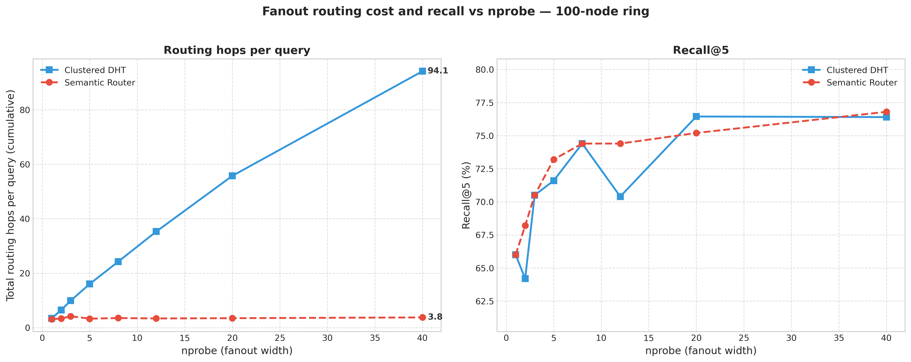

# Decentralized Vector Database (P2P Semantic Router)

This project is a Proof of Concept (v1.0) for a highly scalable, decentralized Vector Database. It marries the robust peer-to-peer architecture of a **Chord Distributed Hash Table (DHT)** with the mathematical precision of **Semantic Vector Search (KNN)**.

Unlike traditional categorical DHTs that rely on random SHA-1 hashing, this architecture mathematically maps K-Means semantic clusters across the circular ring. This ensures that semantically similar data is hosted in identical or adjacent network regions, enabling powerful distributed fanout queries.

## 🎓 Academic Context

This system is the implementation for the diploma thesis **"Design of a Decentralized Vector Database for MLOps: An Approach Based on Chord DHT and Semantic Distribution"** (_«Σχεδιασμός Αποκεντρωμένης Διανυσματικής Βάσης Δεδομένων για MLOps: Μια Προσέγγιση Βασισμένη σε Chord DHT και Σημασιολογική Κατανομή»_), submitted to the **Computer Engineering and Informatics Department (CEID), University of Patras**.

- **Author:** Spyridon Manolatos
- **Supervisor:** Gerasimos Vonitsanos

## 📂 Directory Layout

```text
├── data/                      # Database and results storage
│   ├── benchmarks/            # Evaluation results and documentation
│   │   ├── plots/             # Rendered charts (PNG)
│   │   │   ├── local/         # Local simulation plots
│   │   │   └── containerized/ # Containerized cluster plots
│   │   ├── results/           # Raw collected metrics (JSON)
│   │   │   ├── local/         # Local simulation JSON results
│   │   │   └── containerized/ # Containerized cluster JSON results
│   │   └── README.md          # Benchmark results analysis report
│   ├── models/                # Trained K-Means centroids and TF-IDF artifacts
│   └── raw/                   # Udemy Kaggle CSV dataset and normalized JSON payloads
├── src/                       # Database source code
│   ├── architectures/         # Database topologies
│   │   ├── monolithic_linear/ # Centralized exhaustive KNN baseline
│   │   ├── standard_dht/      # Standard random-hash Chord DHT ring
│   │   ├── clustered_dht/     # Hashed K-Means clusters DHT ring
│   │   └── semantic_router/   # Mapped Agglomerative semantic Chord ring (Proposed)
│   ├── benchmarks/            # Scalability, fault-tolerance, node-join and disaster benchmarks
│   │   ├── local/             # Local simulation evaluation scripts
│   │   ├── containerized/     # Containerized cluster evaluation scripts
│   │   └── metrics.py         # Shared evaluation metrics library
│   ├── core/                  # Decoupled config loader and shared core utilities
│   ├── ml/                    # ML clustering and vocabulary training pipeline
│   └── scripts/               # Kaggle csv normalizer, synthetic generators, blue/green ingestion log
├── local_simulation/          # Local Threaded Simulation environment configuration & scripts
│   ├── run_simulation.py      # Simulation runner (scenario CLI)
│   └── config.local.yaml      # Configuration for local simulation run
├── containerized_environment/ # Distributed Containerized environment configuration & files
│   ├── Dockerfile             # Node container definition
│   ├── docker-compose.yml     # Distributed cluster setup and client runner
│   ├── app.py                 # Node service launcher (one ring identity per process)
│   ├── app_vnodes.py          # Virtual-node launcher (many ring identities per process)
│   ├── docker-compose.vnodes.yml # Isolated large-ring (25-140 node) topology
│   ├── config.prod.yaml       # Configuration for Docker production run
│   └── config.vnodes.yaml     # Configuration for the virtual-node scaling study (K=4096)
├── k8s/                       # Kubernetes deployment (StatefulSet-based ring, see k8s/README.md)
├── docs/                      # Project documentation (pipeline notes, scripts.md)
├── run_all_benchmarks_fullcorpus.sh # 5-node suite: characterize/scale/fault/join/disaster (see docs/scripts.md)
├── run_hops_scale_async.sh    # Headline routing-hops scaling result (50/100-node virtual ring)
├── run_vnode_disaster.sh      # 100-node uniform-disaster distribution
├── run_doomed_scenario.sh     # 100-node worst-case scenario
├── config.yaml                # Decoupled network and database parameters file
└── README.md                  # Main project overview and run instructions
```

## 🏗️ Approaches Implemented

This repository implements and compares four different architectural approaches to Vector Search:

1. **Monolithic Linear Search (`src/architectures/monolithic_linear/`):** A centralized baseline that performs an exhaustive linear scan (exact KNN) over all vectors. Provides perfect recall but scales poorly as $O(N)$.
2. **Standard DHT (`src/architectures/standard_dht/`):** A standard Chord DHT implementation where vectors are distributed using random SHA-1 hashing. Provides highly scalable storage, but similarity queries are inefficient as they require broadcasting to all nodes because semantic locality is lost.
3. **Clustered DHT (`src/architectures/clustered_dht/`):** A hybrid baseline where data is grouped via K-Means, but the clusters are placed on the ring using random SHA-1 hashing rather than semantic geometric mapping. 
4. **P2P Semantic Router (`src/architectures/semantic_router/`):** The novel approach where the DHT ring is mathematically partitioned using K-Means centroids. Data is routed based on semantic similarity rather than random hashes: the primary cluster is resolved via a standard Chord lookup ($O(\log N)$), and each additional cluster in the `nprobe` fanout is reached in $O(1)$ via direct successor/predecessor hops, for a total query cost of $O(\log N + nprobe)$.

---

## 🏗️ The Data Pipeline & Kaggle Dataset

The system is tested using a real-world dataset of Udemy courses sourced from Kaggle. To ensure fair and consistent evaluation across all architectures, the raw data is passed through a unified preprocessing schema before being injected into the P2P network.

1. **Preprocessing (`src/ml/train_centroids.py` / Data Loaders):** The raw Kaggle dataset is parsed, and course titles, descriptions, and categories are unified into a standard schema.
2. **Feature Extraction:** The text is vectorized using TF-IDF (L2 Normalized) to represent the semantic meaning of the courses.
3. **Clustering:** A standard K-Means model (K=80) is trained to group the vectors into semantic clusters.
4. **Hierarchical Ordering (Dendrogram Leaf-Ordering):** K-Means alone assigns cluster IDs arbitrarily — ID 5 and ID 6 could be semantically unrelated. To fix this, the K centroids are fed into **agglomerative clustering** (`scipy.cluster.hierarchy.linkage`), and the resulting dendrogram is flattened into a single left-to-right order via `leaves_list`. Cluster IDs are then reassigned along this 1-D order, so that **numerically adjacent cluster IDs are guaranteed to be semantically adjacent** — the property the Semantic Router's linear ring mapping and its `nprobe` fanout both depend on. The final ordered centroids are written to `centroids.json`, the model the DHT nodes use to map data.

---

## 🔑 Key Architectural Features

1. **Semantic Centroid Routing:** Nodes automatically vectorize raw text using TF-IDF and route the data to the correct cluster ID on the DHT ring.
2. **True Vector Embeddings:** Text is vectorized exactly _once_ during insertion (`PUT`), avoiding heavy $O(N)$ text-processing bottlenecks during queries.
3. **`nprobe` Distributed Fanout:** Similarity queries (`GET`) can seamlessly branch out across multiple mathematical clusters to merge results, allowing a dynamic trade-off between speed and recall. Only the first cluster costs a full $O(\log N)$ Chord lookup; each subsequent probed cluster is reached in $O(1)$ via direct successor/predecessor hops, since semantically adjacent clusters are mapped to ring-adjacent nodes.
4. **Active Replica Delegation (implemented, not validated):** Targets the "Hot Spot" CPU problem — a node under high query load delegates reads to its replica, adding read capacity without data migration. The mechanism is implemented, but it stalls under sustained query rate, so it is **excluded from the benchmark suite** and reported as a design rather than a result (see [`docs/scripts.md`](docs/scripts.md)).
5. **Self-Healing Fault Tolerance:** Standard Chord stabilization protocols ensure that if a Primary node crashes, the Replica node instantly promotes its backup data to Primary.

---

## 🚀 Setup Instructions

This project requires a standard Python environment (Python 3.8+ recommended).

### 1. Create a Virtual Environment (Recommended)

```bash
python3 -m venv .venv
source .venv/bin/activate
```

### 2. Install Dependencies

```bash
pip install -r requirements.txt
```

### 3. Configuration

The system parameters are fully decoupled from the code. You must create a local configuration file before running anything:

```bash
cp config.yaml.example config.yaml
```

_(You can open `config.yaml` to modify the number of nodes, replication factor (RF), ports, and dataset paths)._

---

## 🧠 Dataset Creation & ML Training Pipeline

Before running any simulations, the nodes need mathematical centroids to perform semantic routing. The dataset and models will be cleanly saved to the `data/` directory.

**Step 1: Generate the Raw Dataset**
Generate synthetic courses to populate `data/raw/data.json`. The number of courses is defined in `config.yaml` (`num_courses`).
```bash
python3 src/scripts/generate_synthetic_data.py
```

**Step 2: Train the Semantic K-Means Centroids**
This script parses the raw dataset, builds a TF-IDF vocabulary, and trains the semantic clusters. The resulting `centroids.json` is saved in `data/models/` so the DHT nodes can use it for $O(1)$ routing.
```bash
python3 src/ml/train_centroids.py
```

> **This synthetic `K=80` model is for the local threaded simulation.** The **containerized benchmarks** run on the full 98,104-course Kaggle corpus with a fine-grained `k=4096` model (`kaggle_centroids_k5500.json`) and exact full-corpus ground truth — a separate artifact set built by a different pipeline (`ingest_kaggle_data.py` → `train_centroids_bigk.py` → `gen_queries_bigk.py`). The complete step-by-step runbook to build those artifacts and run every benchmark lives in **[`docs/scripts.md`](docs/scripts.md)**.

---

## 🧪 Running the Simulations

The local threaded simulation environment runs multiple ChordNode instances inside the same Python process on loopback IP (`127.0.0.1`) separated by ports. All local simulations are consolidated into a clean CLI interface.

To run the local simulation scenarios, execute the following from the project root:

*   **Scenario 1: Semantic Routing & KNN**
    Proves the non-random ring mapping and the distributed Cosine Similarity search:
    ```bash
    python3 local_simulation/run_simulation.py --scenario routing
    ```

*   **Scenario 2: Fault Tolerance & Self-Healing**
    Simulates node crashes, proving that replication recovery and successor healing work:
    ```bash
    python3 local_simulation/run_simulation.py --scenario failure
    ```

*   **Scenario 3: Dynamic Node Join**
    Joins a new node to the active network, proving automatic data migration:
    ```bash
    python3 local_simulation/run_simulation.py --scenario join
    ```

*   **Boot Network Only:**
    Boots up the network and keeps it active for manual XML-RPC queries:
    ```bash
    python3 local_simulation/run_simulation.py --scenario boot
    ```

---

## 🐳 Running in Containerized Environment (Docker)

To test the P2P Vector Database under real network isolation, isolated Dockerized cluster configurations are provided under separate folders in `containerized_environment/`. 

Each directory contains its own `docker-compose.yml` file, which spins up a dedicated cluster and automatically sets up an isolated Docker bridge network (e.g. `standard_dht_default`, `semantic_router_default`), ensuring complete routing isolation between architecture tests.

### 1. Build Node Container Image
You can build the shared `p2p-semantic-router` Docker image from any of the folders:
```bash
cd containerized_environment/semantic_router
docker compose build
```

### 2. Orchestrate Distributed Clusters (By Architecture)
Navigate to the targeted subfolder and launch the 5-node Chord ring (1 bootstrap node, 4 worker nodes) in the background:

*   **Standard Chord DHT (Random Hashing):**
    ```bash
    cd containerized_environment/standard_dht
    docker compose up -d
    ```
*   **Clustered Chord DHT (K-Means Hashing):**
    ```bash
    cd containerized_environment/clustered_dht
    docker compose up -d
    ```
*   **Semantic Router Chord DHT (Proposed):**
    ```bash
    cd containerized_environment/semantic_router
    docker compose up -d
    ```

### 3. Tear Down Cluster
Stop and clean up containers and networks inside the respective folder:
```bash
docker compose down
```

---

## ☸️ Kubernetes Deployment

Beyond Docker Compose, the Semantic Router ring can be deployed on **Kubernetes** as a
`StatefulSet` — stable per-pod network identity (`dht-0.dht`, `dht-1.dht`, …), a
Chord-aware readiness probe (a pod receives no traffic until every virtual node it
hosts reports a converged finger table), and per-pod persistent volumes that let a
respawned pod **warm-start** from its own previously-stored shard instead of
rejoining empty.

This is a **deployment demonstration**, not a source of Chapter 6 measurements —
Kubernetes pod DNS names hash to different ring positions than the Compose
hostnames, so any routing-hops numbers would only match the reported results in
shape, not value. Its evidence is *deployment behavior*: declarative elastic
scaling (`kubectl scale`) with exact data conservation across the operation, and
self-healing recovery (pod killed → Chord masks the outage within seconds →
Kubernetes respawns the identity → the new pod reloads its data from its volume
with zero loss), all verified against a live 100-identity ring with real
injected data.

Full manifests, a step-by-step walkthrough, and captured demo evidence live in
**[`k8s/README.md`](k8s/README.md)** and **[`k8s/demo-logs/`](k8s/demo-logs/)**.

---

## 🌐 Interactive Query Gateway (Demo Application)

The project ships with a small **HTTP gateway application** that lets you run live similarity queries against a running cluster from the browser and *see the DHT routing happen*: which node the query entered from, which semantic clusters the entry node decided to probe, where nodes and clusters sit on the Chord identifier ring, the finger tables along the lookup path, and — most importantly — **how many hops each lookup took**.

> **Design note:** the application is deliberately **monolithic — backend only**. There is no separate frontend project; the FastAPI service ([`src/api/main.py`](src/api/main.py)) serves both the JSON API and a single self-contained demo page. This is intentional: the goal of the application is not web engineering, but building **intuition about the hop mechanics** of the three DHT architectures. Everything of scientific interest (entry-node selection, cluster→ring placement, lookup paths, hop counting) lives in the backend and is exposed transparently.

Each query enters the ring through a **random node**, simulating an arbitrary peer receiving a request in a real P2P deployment (a specific entry node can also be forced via the API).

### 1. Start a cluster with its gateway
Every compose stack ships the gateway. The **async** stacks are the reported architecture (FastAPI/httpx):

*   **Async Semantic Router** — gateway at **http://localhost:8080**:
    ```bash
    cd containerized_environment/async_semantic_router
    docker compose up -d --build
    ```
*   **Async Clustered DHT** — gateway at **http://localhost:8081**:
    ```bash
    cd containerized_environment/async_clustered_dht
    docker compose up -d --build
    ```
(`--build` is only needed the first time, or after changing `requirements.txt`. The legacy **sync** XML-RPC stacks under `semantic_router/` and `clustered_dht/` also carry a `gateway` on the same ports.)

> **Configuration note:** the gateway ([`src/api/main.py`](src/api/main.py)) is not hardcoded to
> either architecture or transport. Which nodes it talks to (`DHT_NODES`), its display name
> (`GATEWAY_TITLE`), and the RPC transport (`TRANSPORT=xmlrpc` for the sync stacks, `TRANSPORT=json`
> for the async FastAPI/httpx stacks) are all set via environment variables in each stack's
> `docker-compose.yml`. That's why the same gateway image serves the sync Semantic Router/Clustered
> stacks *and* the async ones (`DHT_NODES=async-bootstrap-node:5000,...`, `TRANSPORT=json`) with no
> code changes — only the compose environment differs.

### 2. Inject data
Node storage is **in-memory**, so the ring starts empty after every `up`/restart. Fill it with the Kaggle course dataset:
```bash
# Async Semantic Router stack (TRANSPORT=json)
docker compose exec async-gateway python src/scripts/inject_data.py \
    --node async-bootstrap-node:5000 --limit 500 --transport json

# Async Clustered DHT stack
docker compose exec async-clustered-gateway python src/scripts/inject_data.py \
    --node async-clustered-bootstrap:5000 --limit 500 --transport json

# (legacy sync stacks: omit --transport; e.g. `docker compose exec gateway python src/scripts/inject_data.py --limit 500`)
```
`--limit N` controls how many courses are injected (`0` = the entire dataset). Any ring node works as the injection point — `put_course` routes each record to its responsible peer.

### 3. Query
Open the demo page (**http://localhost:8080** or **:8081**), type a free-text query (e.g. *"python for data science"*), pick an `nprobe`, and hit Search. The page shows:

*   **Entry node, clusters probed, hop count and latency** for the query.
*   A **Chord ring diagram** with every node and probed cluster at its true ring position, plus dashed lookup lines labeled with per-lookup hop counts.
*   The **routing decision table** (cluster hashes, ring positions, serving nodes) and the **finger tables** of every node the lookup passed through, with the jump actually taken highlighted.

Running the same `nprobe = 3` query on both gateways side by side demonstrates the core thesis result: the Semantic Router's linearly-mapped clusters sit adjacent on the ring (one cheap lookup), while SHA-1 scatters the Clustered DHT's clusters across the ring, forcing a separate multi-hop lookup per cluster.

The raw API is also available: `POST /query` (`{"query": "...", "nprobe": 1-10, "entry_node": optional}`), `GET /nodes` for live ring membership, and interactive OpenAPI docs at `/docs`.

---

## 📊 Benchmarks & Results

> **📈 Full evaluation report:** [`data/benchmarks/README.md`](data/benchmarks/README.md) — the head-to-head **Semantic Router vs. Clustered DHT** comparison across all seven experiments (scaling, routing hops, fault tolerance, node join, sparse & dense disaster, doomed worst-case), each with its figure, the underlying numbers, and a **who-wins verdict**, plus a summary table and the honest bottom line.

This project supports running comprehensive benchmarking suites in both the **local threaded simulation** and the **containerized Docker environment**. The results for each run are isolated into separate folders.

### 1. Local Threaded Evaluation
Run evaluations and generate plots for the local loopback DHT ring:

*   **Execute all local benchmarks:**
    ```bash
    python3 -m src.benchmarks.local.evaluate --mode all
    ```
*   **Execute specific modes (scale / fault / join / load):**
    ```bash
    python3 -m src.benchmarks.local.evaluate --mode scale --dataset_size 2000
    ```
*   **Generate Local Charts:**
    ```bash
    python3 -m src.benchmarks.local.plot
    ```
    _Outputs are saved to `data/benchmarks/results/local/` and `data/benchmarks/plots/local/`._

### 2. Containerized Cluster Evaluation

#### Option A — Full suite via runner scripts (recommended)
Four scripts at the project root each orchestrate one containerized benchmark end to end — bring up the ring, inject the full corpus, run `evaluate.py`, tear down, and (for the 5-node suite) regenerate the comparison charts:

```bash
./run_all_benchmarks_fullcorpus.sh      # 5-node suite: characterize, scale, fault, join, disaster
./run_hops_scale_async.sh 20            # 100-node routing-hops headline (5 x 20 vnodes)
./run_vnode_disaster.sh 20 30           # 100-node uniform-disaster distribution
./run_doomed_scenario.sh 20 30          # 100-node worst-case scenario
```

All four run the async **semantic-router vs. clustered-DHT** comparison on the full 98,104-course corpus, against a shared exact full-corpus ground truth so the two architectures are measured identically.

> **[`docs/scripts.md`](docs/scripts.md) is the single source of truth for running these** — the end-to-end runbook (prerequisites → the global centroid artifact every peer holds → query generation → each script), the per-experiment artifact matrix (corpus, peer count, topology, model, query file), and the ring-convergence notes.

#### Option C — Async (FastAPI/httpx) architectures

Each of the three architectures above has an async counterpart under `src/architectures/async_*` and `containerized_environment/async_*`: identical routing/replication/clustering logic, but the RPC transport is a persistent, connection-pooled `httpx.AsyncClient` talking to a FastAPI/uvicorn server (single asyncio event loop) instead of `xmlrpc.client`/`xmlrpc.server` (blocking connection-per-call, thread-per-request). This isolates transport overhead as an independent variable — `results_async_semantic.json` vs. `results_semantic.json` measures the *same* algorithm under two different RPC stacks.

| Architecture | Sync (XML-RPC) | Async (FastAPI/httpx) | `--arch` flag |
|---|---|---|---|
| Standard DHT | `containerized_environment/standard_dht` | `containerized_environment/async_standard_dht` | `standard` / `async_standard` |
| Clustered DHT | `containerized_environment/clustered_dht` | `containerized_environment/async_clustered_dht` | `clustered` / `async_clustered` |
| Semantic Router | `containerized_environment/semantic_router` | `containerized_environment/async_semantic_router` | `semantic` / `async_semantic` |

Each async stack mirrors its sync counterpart exactly (bootstrap + 4 workers + 1 idle `node-5` for the node-join experiment + a `--profile runner` driver), under `async-*`-prefixed container names and offset ports, so sync and async stacks can run side by side without colliding.

```bash
# 1. Build the shared image (only needed once, or after requirements.txt/app.py changes)
cd containerized_environment/async_semantic_router
docker compose build

# 2. Bring up the ring (bootstrap + 4 workers + idle node-5)
docker compose up -d async-bootstrap-node async-node-1 async-node-2 async-node-3 async-node-4 async-node-5

# 3. Run the full benchmark suite (characterize, scale, fault, join, disaster)
docker compose run --rm async-semantic-runner

# 4. Tear down
docker compose down
```
Swap `async_semantic_router`/`async-semantic-*` for `async_clustered_dht`/`async-clustered-*` or `async_standard_dht`/`async-standard-*` (matching service names from each folder's `docker-compose.yml`) to run the other two architectures.

**Virtual-node hops sweep (async):** the async counterpart of `docker-compose.vnodes.yml`, driven by `containerized_environment/async_app_vnodes.py`:
```bash
ARCH=async_semantic NUM_VNODES=20 docker compose -f containerized_environment/docker-compose.async_vnodes.yml up -d --build
docker compose -f containerized_environment/docker-compose.async_vnodes.yml run --rm runner \
  -m src.benchmarks.containerized.evaluate --arch async_semantic --mode hops \
  --containers av-bootstrap,av-node-1,av-node-2,av-node-3,av-node-4 --vnodes_per_container 20 \
  --queries_file data/benchmarks/queries/queries_98k_k4096.json
docker compose -f containerized_environment/docker-compose.async_vnodes.yml down --remove-orphans
```
Use `ARCH=async_clustered` for the clustered comparison point (standard is skipped here, same as in the sync hops sweep — its recall doesn't depend on clustering).

#### Option B — Per-architecture, manually
Ensure the cluster nodes for your target architecture are active, then run evaluations inside its distinct runner container:

*   **Run Standard Chord DHT Benchmarks:**
    ```bash
    cd containerized_environment/standard_dht
    docker compose run standard-runner
    ```
*   **Run Clustered Chord DHT Benchmarks:**
    ```bash
    cd containerized_environment/clustered_dht
    docker compose run clustered-runner
    ```
*   **Run Semantic Router Chord DHT Benchmarks:**
    ```bash
    cd containerized_environment/semantic_router
    docker compose run semantic-runner
    ```
*   **Generate Containerized Comparison Charts:**
    `run_all_benchmarks_fullcorpus.sh` already regenerates the charts at the end of a run. To (re)plot from existing result JSONs without re-running the suite, invoke the matplotlib plotter in any async runner — it reads the `*_async_*` result files (semantic router vs. clustered DHT) and writes the figures back to the host:
    ```bash
    cd containerized_environment/async_semantic_router
    docker compose -f docker-compose.yml -f docker-compose.k5500.yml run --rm --no-deps \
      --entrypoint python async-semantic-runner -m src.benchmarks.containerized.plot
    ```
    _Figures are written to `data/benchmarks/plots/containerized/`._

### Metrics Measured:
- **Search Recall:** Accuracy compared to a monolithic exact-KNN baseline.
- **Network Hops:** Average routing hops and semantic cluster mapping efficiency.
- **End-to-End Latency:** Search latency scaling advantages under concurrent query workloads.
- **Healing & Migration Speed:** Duration (in seconds) for rings to heal after node crashes and migrate primary keys on node joins.

**Please view [`data/benchmarks/README.md`](data/benchmarks/README.md) for the full evaluation report — the head-to-head Semantic Router vs. Clustered DHT comparison across all seven experiments, each with its figure, numbers, and a who-wins verdict.**

---

## 🏆 Key Containerized Benchmark Findings

The following plots represent the final "apples-to-apples" comparison of all three architectures running in fully isolated Docker container networks. 

### 1. Scaling Metrics (nprobe vs Hops & Latency)
Demonstrates how the **Semantic Router**'s hop count grows only by $O(1)$ per additional probed cluster as the search radius (`nprobe`) expands, while the **Clustered DHT** suffers linear hop growth due to randomized hash scatter.


### 2. Routing Efficiency at Scale — 100 Nodes, Full 98,104-Course Corpus (Headline Result)
The scaling result above is confirmed at production scale: a **100-virtual-node ring**, a **K=4096 fine-grained clustering**, and the **entire Kaggle corpus** (no subsampling), queried against a held-out set of 50 fixed queries with exact-cosine ground truth.



At every `nprobe` value tested (1 through 40), **recall@5 is byte-identical between the two architectures** — both probe the exact same set of semantic clusters, so this isolates routing cost as the only variable. The routing cost is not remotely comparable:

| nprobe | Recall@5 (both architectures) | Semantic Router hops | Clustered DHT hops |
|---|---|---|---|
| 1  | 57.2% | 2.74 | 3.26 |
| 8  | 74.4% | 2.88 | 22.42 |
| 40 | 77.6% | **3.64** | **85.48** |

At `nprobe=40`, the Semantic Router needs **23.5× fewer hops** than the Clustered DHT to retrieve the exact same result set — because semantically adjacent clusters are mapped to ring-adjacent nodes, so each additional probed cluster costs one $O(1)$ successor/predecessor hop instead of a fresh $O(\log N)$ Chord lookup. This gap **widens** with ring size and `nprobe`, since Clustered DHT's cost is $O(nprobe \cdot \log N)$ against Semantic Router's $O(\log N + nprobe)$.

### 3. Network Expansion (Dynamic Node Joins)
Demonstrates the impact of dynamically scaling the network from 5 nodes to 6 nodes.


### 4. Fault Tolerance (Node Crashes)
Demonstrates the recall resiliency of the architectures when random nodes are forcibly killed.


### 🏆 Conclusion: Which Architecture Wins?

There is no single "silver bullet" — but the winner is decided by the **metric and the failure model**, not by network density alone (an earlier density-based framing that the dense-ring disaster experiment refuted):

1. **Routing efficiency & scalability: the Semantic Router wins — decisively and *always*.**
   Because adjacent semantic clusters map to adjacent ring positions, fanning out to `nprobe` clusters costs ~one lookup regardless of ring size: **~4 hops vs. the Clustered DHT's ~91 at 100 nodes, at identical recall**. Semantic **decouples recall from routing cost**; clustered chains them.
2. **Normal operation, recall, single/random failures, and node join: a tie.**
   Both place data identically (same recall), both mask a single node loss via replication (full recovery), and both conserve data across a 5→6 node join.
3. **Correlated / hot-node failures: the Clustered DHT is more robust — at *any* density.**
   SHA-1 scatter spreads a correlated loss thin; the Semantic Router's locality concentrates popular topics, so killing a hot node blacks out a whole topic community. This holds in **sparse** rings (13.2% vs. 33.3% post-disaster recall) **and** in **dense** rings (9.2 vs. 4.5 pp mean drop, 89 vs. 45 queries hit, 0% vs. 11.2% recovery at 100 nodes). Density *narrows* the gap but does not flip it.

**The bottom line:** topology-aware placement buys a ~22× routing-cost reduction *for free* in the common case (recall is unchanged), and its **only** price is correlated-failure resilience — a cost that is **failure-model-dependent** (negligible for random failures, real for adversarial hot-node failures).

*(All of the above is quantified experiment-by-experiment, with figures, in the full evaluation report: [`data/benchmarks/README.md`](data/benchmarks/README.md).)*

### 🧠 The Dual-Purpose of `nprobe`
In traditional Machine Learning vector databases, `nprobe` is purely an **accuracy parameter**. However, in this decentralized P2P architecture, `nprobe` serves a critical dual purpose:
* **1. Semantic Recall:** Increases the geometric search radius to find better matches.
* **2. Physical Fault Tolerance:** Physically expands the query footprint across multiple network nodes. Higher `nprobe` mathematically increases the probability of hitting surviving replica nodes during a catastrophic ring failure!

---

## 🔮 Future Work

With the core architectures, dynamic self-healing, and replication data migration fully benchmarked, future work will focus on scaling the deployment to production-grade distributed environments and on keeping the semantic mapping current as the corpus drifts:

1. **Real Network Latency & Multi-Machine Deployment:**
   - Docker and Kubernetes container deployments are already implemented (see the "Kubernetes Deployment" section above and [`k8s/README.md`](k8s/README.md)), but both currently run on a single host, so all reported latency remains relative-only.
   - Remaining work: deploying across physically distinct machines/regions to introduce real network propagation latency (e.g., 5ms to 50ms) and evaluate the overhead of multi-hop Chord routing queries and background stabilization under real network conditions.

2. **Multi-Core Hardware Isolation (GIL Workload Optimization):**
   - Setting explicit CPU and memory resource constraints (limits/requests) per containerized node.
   - Measuring concurrent throughput scaling without local Python GIL thread-scheduling bottlenecks, which is also the prerequisite for revisiting the replica-delegation mechanism (feature 4 above) under a sustained query rate.

3. **Network Chaos Engineering & Unclean Crashes:**
   - Utilizing tools like Chaos Mesh to inject packet drops, random packet delay (jitter), and split-brain network partitions to evaluate the robustness of the Chord ring stabilization protocols under adversarial network conditions.

4. **Massive Scale-Out Evaluations:**
   - A 100-virtual-node ring (K=4096 centroids) over the full 98,104-course corpus has already confirmed the routing-efficiency result at this scale (23.5× fewer hops than Clustered DHT at identical recall).
   - Remaining work: scaling to 1,000+ *physical* nodes to confirm the same $O(\log N + nprobe)$ routing-cost behavior beyond a single-host virtual-node ring, at a true enterprise scale.

5. **Adaptive Cluster Retraining (Blue/Green Ring Migration):**
   - The semantic mapping — the K-Means centroid table plus its TF-IDF vocabulary, referred to as the *artifact* — is trained once, offline, and frozen. As the corpus drifts (new topics appear, existing clusters grow unevenly), routing quality degrades as the frozen artifact falls out of sync with the data it maps.
   - Retraining is not a hot swap: a new artifact changes both the cluster IDs and their dendrogram leaf ordering, i.e. the ring mapping itself, so every document's placement changes at once.
   - Planned approach: run two independent Chord rings side by side, each on its own artifact, with a single entry point selecting which is live. The new ring is validated on a fraction of real traffic before an atomic cutover, and the old ring is kept warm so rollback is the same operation reversed — all without reintroducing a central routing authority.
   - **Current focus — keeping the access coordinator from becoming a single point of failure.** The entry point (a DNS/headless-Service based address that clients resolve to reach a ring) is the one centralized component in this design, so the work is on bounding what its loss actually costs. Clients cache the peer addresses they have already resolved and dial those peers directly, and joining nodes learn the ring from a bootstrap contact rather than from a directory — so a DNS outage blocks only *new* clients that have never resolved an address and *new* nodes attempting to join. Every already-bootstrapped client keeps querying, and all intra-ring Chord routing, stabilization and self-healing continue untouched. This is the same discovery-vs-routing separation used by DNS seeds in Bitcoin, EIP-1459 node lists in Ethereum, the Mainline DHT bootstrap routers in BitTorrent, and gossip seed nodes in Cassandra: the central name answers *"name me a live peer"*, never *"who owns this key"*.
   - The open tension being measured: that same client-side address cache is what makes a cutover non-instantaneous, since a cached client keeps talking to the old ring until its entry is refreshed. Cache lifetime therefore trades DNS-outage tolerance against cutover propagation delay, and picking that bound is part of the current work.
   - Status: **design + prototype in progress** on the `feat/adaptive-retraining` branch — see [`k8s_bluegreen/`](k8s_bluegreen/). Two isolated rings, a repointable entry point with demonstrated cutover and rollback, and a shared replayable ingestion log feeding both rings are built and working; the canary gate, the discrepancy classifier and runtime artifact adoption are not. Nothing in this item is benchmarked yet.
   - First measured result from the prototype: the second artifact is the first one *retrained after the corpus doubled* — its training input is a strict superset of the first's, the mildest realistic retraining event. With the ingested corpus and the node positions held identical and only the artifact varied, **every sampled document changed cluster and 14 of 15 changed owning node**. Nothing in the pipeline preserves label identity across training runs (K-Means cold-starts, then leaf-ordering relabels every centroid), so this is the concrete form of the "retraining is not a hot swap" claim above.

---

## 👥 Credits & Attributions

This project uses the **Udemy Courses Dataset** compiled and published on Kaggle by [Emre Bayir](https://www.kaggle.com/datasets/emrebayirr/udemy-course-dataset-categories-ratings-and-trends). We thank the author for providing this comprehensive set of course metrics and descriptions for empirical study.
