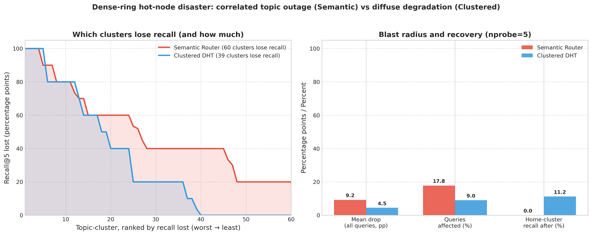
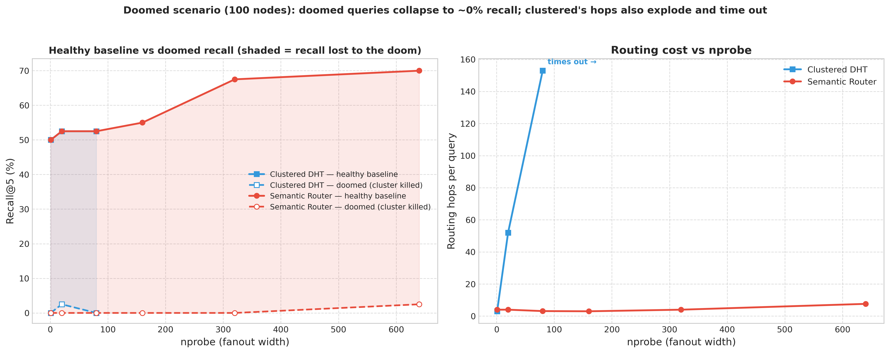
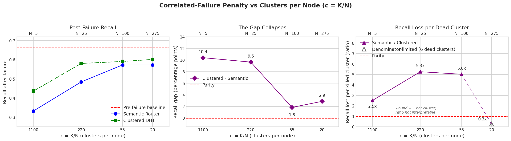

# Evaluation Report — Semantic Router vs. Clustered DHT

This report summarises the containerized benchmark results stored under
`results/containerized/` and compares the two architectures head to head, one
experiment per section, each with its figure and a **who-wins** verdict. For how
these results are produced (scripts, corpus, topologies, query sets), see
[`../../docs/scripts.md`](../../docs/scripts.md). Figures are regenerated by
`src/benchmarks/containerized/plot.py` from the JSON result files.

## What is compared

| | Semantic Router | Clustered DHT |
|---|---|---|
| Cluster → ring placement | **topology-aware**: agglomerative leaf-ordering maps semantically adjacent clusters to adjacent ring positions | **SHA-1 hash** of the cluster id — clusters scattered uniformly (the LSH-Chord / state-of-the-art approach) |
| Consequence | a query's `nprobe` clusters sit in one contiguous ring arc → resolved in ~one lookup | each of the `nprobe` clusters is a separate multi-hop lookup |

Both run the **identical** pipeline otherwise: same 98,104-course Kaggle corpus,
same `k=5500` centroid model, same TF-IDF vocabulary, same RF=2 replication, same
async (FastAPI/httpx) transport. Only placement/routing differs, so every
difference below is attributable to placement alone.

### Reading the metrics
- **Recall@5** and **hops** are *logical* — independent of hardware and
  contention — these are the load-bearing metrics.
- **Latency (ms)** is wall-clock on a single host running 5 containers; it is
  contention-contaminated and should be read as an *upper bound / shape*, not an
  absolute. The monolithic exact-search baseline (~52–56 ms) is an in-process
  numpy scan with no network, so it is naturally the latency floor — the DHT
  trades per-query latency for horizontal scalability, not for speed at this N.

---

## 1. Scaling — recall / hops / latency vs. nprobe (5-node ring, full corpus)

| nprobe | Recall@5 (both) | Hops — Semantic | Hops — Clustered | Latency — Semantic | Latency — Clustered |
|---|---|---|---|---|---|
| 1  | 66.0% | 1.00 | 1.18 | 307 ms | 237 ms |
| 5  | 73.2% | 1.00 | 3.54 | 318 ms | 521 ms |
| 20 | 75.2% | 1.02 | 5.36 | 743 ms | 1144 ms |
| 80 | 77.6% | 1.06 | 5.94 | 1240 ms | 3095 ms |

**Recall is identical at every nprobe** (same clusters retrieved). Semantic keeps
hops ≈ 1 regardless of fanout; clustered grows toward ~6, and latency tracks it.
**Winner: Semantic** (same recall, far cheaper routing) — recall itself is a tie.

## 2. Routing hops at scale — the headline result (100-node ring)

| nprobe | Recall (both) | Hops — Semantic | Hops — Clustered |
|---|---|---|---|
| 1  | 57.2% | 2.84 | 3.12 |
| 5  | ~71%  | 2.84 | 15.88 |
| 20 | 77.6% | 3.38 | 52.52 |
| 40 | ~77%  | **4.24** | **91.32** |

At 100 nodes and full fanout, clustered pays **91.3** hops per query to semantic's
**4.2** — a **~22× routing-cost gap at identical recall**. Semantic **decouples
recall from routing cost**; clustered chains them. **Winner: Semantic (decisive).**

## 3. Fault tolerance — single node failure, transient → healed (nprobe=2)

| State | Recall — Semantic | Recall — Clustered | Hops — Semantic | Hops — Clustered |
|---|---|---|---|---|
| Baseline  | 68.2% | 68.2% | 1.00 | 2.08 |
| Transient (mid-recovery) | 68.2% | 67.8% | 0.96 | 1.22 |
| Healed | 68.2% | 68.2% | 0.90 | 1.74 |

Both **fully recover to baseline** — a single failure is masked by replication in
either architecture. Semantic shows no transient dip and fewer hops.
**Winner: Tie** (both resilient; slight edge to Semantic on the transient).

## 4. Node join — dynamic ring expansion 5 → 6 nodes (nprobe=2)

| | Recall — Semantic | Recall — Clustered | Hops — Semantic | Hops — Clustered |
|---|---|---|---|---|
| Original (5 nodes) | 68.2% | 68.2% | 1.00 | 2.08 |
| Expanded (6 nodes) | 68.2% | 68.2% | 1.08 | 1.82 |

Adding a node conserves data in both — **recall is preserved with zero loss**
across the join. **Winner: Tie** (both migrate data correctly).

## 5. Disaster — correlated failure, sparse ring (5 nodes, kill RF+1=3 adjacent)

| | Baseline | After disaster |
|---|---|---|
| Semantic | 73.2% | **13.2%** |
| Clustered | 73.2% | **33.3%** |

Killing a contiguous block hurts semantic more in a sparse ring: its adjacent
peers hold adjacent topics, so a whole topic region goes dark.
**Winner: Clustered** (SHA-1 scatter spreads the loss).

## 6. Disaster — correlated hot-node failure, dense ring (100 nodes, 500 uniform queries)

Headline nprobe = 5. Kill the **heaviest** primary node (realistic hot-node loss).

| | Mean recall drop | Queries affected | Home-cluster outcome | Failure shape |
|---|---|---|---|---|
| Semantic | **9.2 pp** | **89 / 500 (17.8%)** | 52.8% → **0.0%** (blank pages) | **bimodal** — a whole topic community wiped, rest untouched |
| Clustered | **4.5 pp** | **45 / 500 (9.0%)** | 73.1% → **11.2%** (partial) | **diffuse** — fewer hit, graded degradation |

Under a hot-node kill, semantic pays twice: **2× larger blast radius** (89 vs 45)
**and no recovery** (contiguous neighbours also die). Clustered's scattered
replicas give partial recovery. **Winner: Clustered.** The real contribution is
the *shape*: semantic fails as a **correlated topic outage**, clustered as
**uniform slight degradation** — an SLA-relevant distinction the mean hides.

## 7. Doomed worst-case — queries built from the killed cluster's own members (100 nodes)

| nprobe | Doomed recall — Semantic | Doomed recall — Clustered | Reachable recall — Semantic | Reachable recall — Clustered |
|---|---|---|---|---|
| 20  | 0.0% | 2.5% | 52.5% (hops 4.0) | 52.5% (hops **52**) |
| 80  | 0.0% | 0.0% | 52.5% (hops 3.1) | 52.5% (hops **153**) |
| 160–640 | ~0% | **times out (0/0)** | up to **70%** (hops flat 3–7.6) | **collapses** |

On the doomed queries themselves both are wiped out — **Tie on survivability**.
But the test exposes semantic's structural advantage: it can raise `nprobe` all
the way to 640 at **flat hop cost**, lifting reachable-recall to ~70%, while
clustered's hops explode (3 → 52 → 153) and it **times out past nprobe ≈ 80**.
**Winner: Tie on the disaster; Semantic on the surrounding normal-op ceiling.**

## 8. The Scale of c — Ring Density vs. Correlated Failure (5 to 275 vnodes)

Section 6.8.4 tests whether the correlated failure penalty is an intrinsic flaw of semantic routing or merely an artifact of ring sparsity ($c = K/N$). Holding the $K=5,500$ model and 500 Zipf-distributed queries fixed while scaling $N \in \{5, 25, 100, 275\}$ ($c \in \{1100, 220, 55, 20\}$):

| N | c = K/N | Draw | Post-failure Recall (Semantic) | Post-failure Recall (Clustered) | Gap (pp) | Dead Clusters (Semantic) | Dead Clusters (Clustered) | Loss Ratio (pp/dead cluster) |
|---|---|---|---|---|---|---|---|---|
| 5   | 1100 | 1 | 33.2% | 43.6% | **10.4** | 959 | 1662 | 2.52× |
| 25  | 220  | 1 | 48.4% | 58.1% | **9.6**  | 126 | 311  | 5.26× |
| 25  | 220  | 2 | 46.4% | 58.9% | **12.5** | 192 | 172  | 2.37× |
| 100 | 55   | 1 | 57.3% | 59.1% | **1.8**  | 34  | 137  | 5.02× |
| 100 | 55   | 2 | 56.8% | 58.9% | **2.1**  | 54  | 166  | 4.12× |
| 275 | 20   | 1 | 57.3% | 60.2% | **2.9**  | 34  | 6    | 0.25× *(denom-limit)* |

**Key Insights:**
1. **The gap collapses dramatically (10.4 pp → 1.8–2.9 pp):** As $N$ grows from 5 to 100, the contiguous arc held by the dead node shrinks from 959 to 34 clusters ($\approx 28\times$ smaller wound).
2. **Normalized loss per cluster remains $>1$ ($c \ge 55$):** The gap closes because the victim holds fewer clusters, not because placement stops mattering. Each dead semantic cluster still costs several times more than a dead clustered cluster due to topic concentration.
3. **Winner: Clustered DHT** on resilience, but the penalty shrinks to a negligible margin in dense, production-grade rings ($c \to 1$).

---

## Summary — Comprehensive Scorecard (Thesis Table 6.13)

| # | Experiment (Section) | Decisive Metric | Winner | Primary Reason |
|---|---|---|---|---|
| — | Search Recall (all runs) | Recall@5 | **Tie** | Identical placement quality; same clusters evaluated |
| 1 | Scaling vs nprobe (6.3) | Hops, Latency | **Semantic** | Flat $O(1)$ fanout vs linear $O(nprobe)$ hops |
| 2 | Routing hops @100 nodes (6.3.1) | Hops @ identical recall | **Semantic** ✅ *(Headline)* | 3.96 vs 93.73 hops ($\approx 23.7\times$ cheaper); recall decoupled from cost |
| 3 | Baseline latency comparison (6.4) | Latency (ms) | **Semantic** | Tracks hops closely (monolithic in-memory is latency floor) |
| 4 | Fault tolerance / Single failure (6.7) | Recall recovery | **Tie** | Both heal to baseline (68.2%); Semantic has zero transient dip |
| 5 | Dynamic node join 5 → 6 (6.5) | Data conservation | **Tie** | Zero recall loss (68.2% $\to$ 68.2%); seamless data migration |
| 6 | Correlated disaster — sparse ring (6.8.1) | Post-failure recall | **Clustered** | 33.3% vs 13.2%; hash scatter prevents total thematic wipeout |
| 7 | Correlated disaster — dense ring (6.8.2) | Blast radius & recovery | **Clustered** | 4.5 pp vs 9.2 pp mean drop; diffuse degradation vs bimodal topic outage |
| 8 | Doomed worst-case (6.8.3) | Doomed recall / Hops | **Tie / Semantic** | Both ~0% on doomed queries; Semantic sustains $nprobe \le 640$ while Clustered times out |
| 9 | The Scale of c (6.8.4) | Resilience gap vs $c = K/N$ | **Clustered** | Clustered wins resilience, but gap collapses from 10.4 pp to 1.8–2.9 pp as ring densifies |

### The Honest Bottom Line
**Semantic Router decisively wins routing efficiency, query latency, and horizontal scalability**, while maintaining **parity in search recall, single-node fault tolerance, and dynamic node joins**. Its sole trade-off is **correlated contiguous node failure** in sparse topologies, where **Clustered DHT is more resilient** because random hashing scatters the loss across independent topics. As proven by the $c$-scale experiments, this trade-off is failure-model-dependent and diminishes in dense, production-scale deployments.

