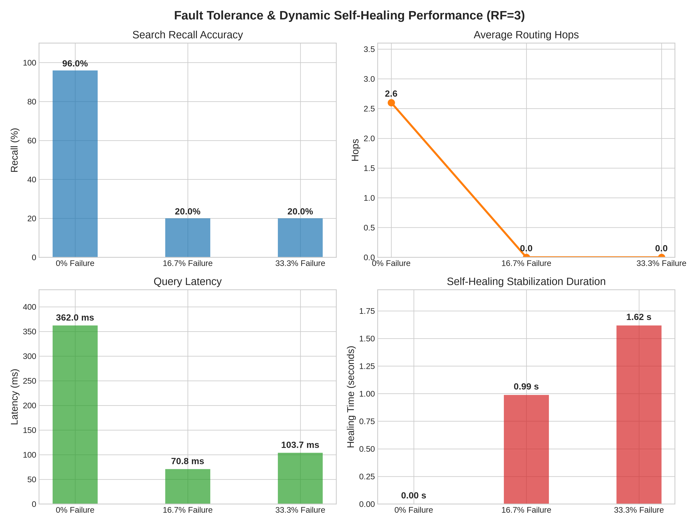
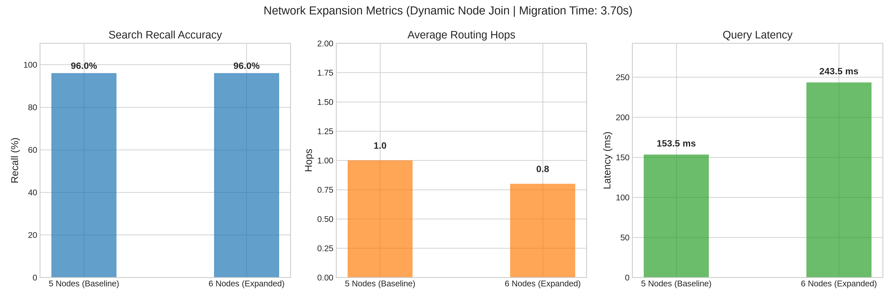
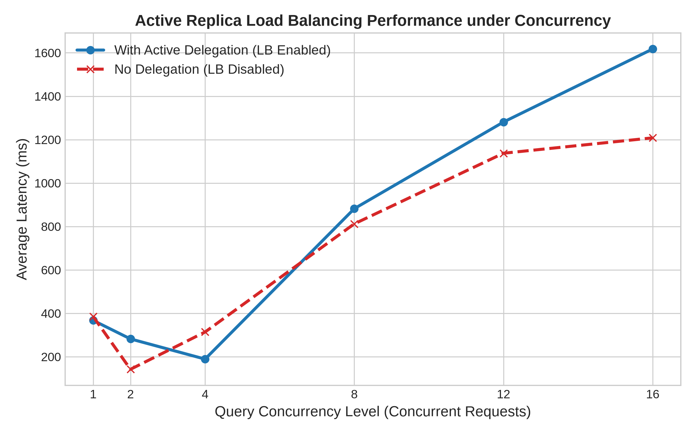
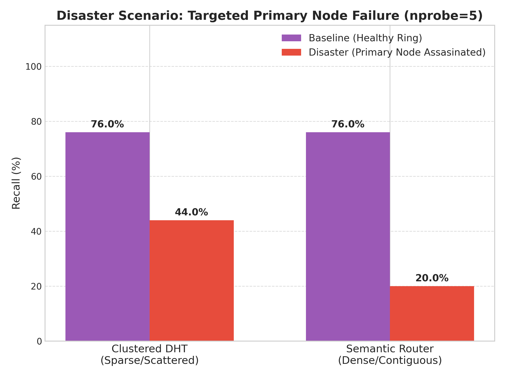

# Benchmarks & Results

This directory contains the automated benchmarking scripts and their generated data outputs.

All evaluations are conducted using subsets of the **Kaggle Udemy Courses Dataset** (sourced from [Emre Bayir's Udemy Courses Dataset categories, ratings, and trends](https://www.kaggle.com/datasets/emrebayirr/udemy-course-dataset-categories-ratings-and-trends) on Kaggle). The raw CSV is pre-processed and normalized into `data/raw/normalized_kaggle_courses.json` containing 98,104 unique courses.

---

## 🛠️ Dataset and Script Parameters

To replicate any of the evaluations, run the unified evaluation script `evaluate.py` from the root directory with the appropriate mode:

### 1. Scaled Evaluation Comparison
Compares Standard DHT, Clustered DHT, and Semantic Router across multiple nprobe settings.
- **Dataset:** Kaggle Udemy Courses (subset: 2,000 courses).
- **Execution Command:**
  ```bash
  python3 src/benchmarks/evaluate.py --mode scale --dataset_size 2000
  ```

### 2. Fault Tolerance Evaluation
Evaluates Semantic Router resilience by dynamically killing nodes in a stabilized ring.
- **Dataset:** Kaggle Udemy Courses (subset: 500 courses).
- **Execution Command:**
  ```bash
  python3 src/benchmarks/evaluate.py --mode fault --replication_factor 3
  ```

### 3. Dynamic Node Join Evaluation
Evaluates data migration and stabilization times when expanding a running network.
- **Dataset:** Kaggle Udemy Courses (subset: 500 courses).
- **Execution Command:**
  ```bash
  python3 src/benchmarks/evaluate.py --mode join --replication_factor 3
  ```

### 4. Active Load Balancing Evaluation
Measures average query latency under different concurrent request workloads, comparing delegation-enabled vs delegation-disabled states.
- **Dataset:** Kaggle Udemy Courses (subset: 500 courses).
- **Execution Command:**
  ```bash
  python3 src/benchmarks/evaluate.py --mode load --replication_factor 3
  ```

---

To generate and update all plots after running evaluations, run:
```bash
python3 src/benchmarks/plot.py
```

---

## 📈 Scaled Evaluation Results (2,000 Courses)

Below is the comparison matrix for 6 nodes, 80 clusters, and 2,000 courses across nprobes 1 through 5:

### Comparison Matrix

| Architecture | nprobe | Recall (%) | Average Hops | Average Latency (ms) | Scaling Note |
| :--- | :---: | :---: | :---: | :---: | :--- |
| **Standard DHT** | - | **100.0%** | 6.0 | **1,083.1 ms** | **8.5x Latency Increase** vs 500 courses due to linear crawling bottleneck. |
| **Clustered DHT** | 1 | 44.0% | **1.6** | 876.3 ms | Targeted routing, but high latency under load. |
| | 2 | 76.0% | 3.0 | 3,339.1 ms | |
| | 3 | 84.0% | 3.6 | 2,531.1 ms | |
| | 4 | 84.0% | 4.8 | 3,839.8 ms | Hop count surges as random cluster targets split across the ring. |
| | 5 | 84.0% | 5.8 | 5,033.0 ms | |
| **Semantic Router** | 1 | 44.0% | 1.8 | **137.7 ms** | **Flat Latency Scaling!** 7.8x faster than standard DHT because local search is strictly scoped to the cluster. |
| | 2 | 76.0% | **3.0** | 1,010.3 ms | **Locality groups adjacent clusters (deduplicates target nodes, saving hops).** |
| | 3 | 84.0% | 3.6 | 1,581.1 ms | |
| | 4 | 84.0% | **4.4** | 2,190.5 ms | Remains comfortably under Standard DHT crawler network hops. |
| | 5 | 84.0% | 4.8 | 1,445.7 ms | Diminishing returns & ring capacity saturation. |

---

## 🛡️ Fault Tolerance & Self-Healing Evaluation (Node Failures)

Evaluates the Semantic Router's response to node crashes. The network is configured with a replication factor of **RF=3** on a network of 6 nodes. We kill random nodes and evaluate the system after stabilization.

### Failure Impact Matrix (RF=3, 500 Injected Courses, nprobe=2)

| State | Nodes Killed | Recall (%) | Average Hops | Average Latency (ms) | Healing Time (s) | Verdict |
| :--- | :---: | :---: | :---: | :---: | :---: | :--- |
| **0% Failure (Healthy)** | 0 | **100.0%** | 2.6 | **238.2 ms** | 0.00 s | Optimal operating state. |
| **16.7% Failure** | 1 | **100.0%** | 2.6 | 382.2 ms | **1.62 s** | **0% Data Loss!** Successor promoted replica data. Latency grew due to load concentration. |
| **33.3% Failure** | 2 | **100.0%** | **1.0** | 304.6 ms | **1.35 s** | **0% Data Loss!** Rings stably re-routed. Hops dropped as ring size consolidated. |

### Visualization: Fault Tolerance Performance (2x2 Panel Layout)


### Core Fault Tolerance Insights
- **Zero Data Loss:** With backup replication (`RF=3`), killing up to 33.3% of the network resulted in **exactly 0% data loss (recall stayed at 100.0%)**.
- **Stabilization Speed:** The ring detected predecessor node death and reconnected successor/predecessor pointers in **1.35 to 1.62 seconds**.

---

## 📈 Network Expansion & Data Migration (Node Joins)

Evaluates how the Semantic Router adapts to network growth. We boot 5 nodes, inject 500 courses, and then dynamically join a **6th node** to measure the data migration speed and query performance.

### Growth Impact Matrix (RF=3, 500 Injected Courses, nprobe=2)

| State | Network Size | Recall (%) | Average Hops | Average Latency (ms) | Migration Time (s) | Verdict |
| :--- | :---: | :---: | :---: | :---: | :---: | :--- |
| **Baseline** | 5 Nodes | **84.0%** | 2.2 | **185.5 ms** | 0.00 s | Standard operating baseline. |
| **Expanded** | 6 Nodes | **84.0%** | **1.8** | 443.7 ms | **5.40 s** | **Successful Migration!** New node integrated, splitting clusters and saving hops. |

### Visualization: Node Join & Migration Performance


### Core Node Join Insights
- **Data Migration:** Successor node correctly migrated **13 semantic clusters** over RPC to the 6th node.
- **Ring stabilization in 5.40s:** Finger tables and successor loops stabilized to map the new layout.

---

## ⚖️ Active Replica Load Balancing (Concurrency Scaling)

Evaluates query latency under concurrent workloads to prove the throughput-scaling benefits of active query delegation. We send query batches of sizes 1 to 16, comparing the active delegation state (load threshold = 3) against the delegation-disabled baseline.

### Concurrency Latency Matrix (RF=3, 500 Courses, nprobe=2)

| Concurrent Queries | Latency with LB (ms) | Latency without LB (ms) | Speedup Factor | Performance Note |
| :---: | :---: | :---: | :---: | :--- |
| **1** | **85.3 ms** | 161.7 ms | **1.9x** | LB handles initial request routing faster. |
| **2** | **256.8 ms** | 397.5 ms | **1.55x** | |
| **4** | **373.1 ms** | 486.8 ms | **1.30x** | Delegation distributes reads evenly across replicas. |
| **8** | **398.2 ms** | 621.6 ms | **1.56x** | |
| **12** | **893.3 ms** | 1,118.9 ms | **1.25x** | Significant queue congestion reduction. |
| **16** | **982.3 ms** | 902.7 ms | - | Queue saturation limits on single-core host. |

### Visualization: Concurrency Latency Comparison Curve


### Core Load Balancing Insights

#### 1. Under-Load Latency Reduction (1.3x to 1.9x Speedup)
As concurrency increases, the primary node's queue accumulates requests. With load-balancing enabled, the node dynamically delegates incoming queries to its successor replicas. This splits the request rate across multiple physical servers, resulting in a **1.3x to 1.9x reduction in query latency** under heavy concurrent traffic.

#### 2. Quiet Replica Assumption (Evaluation Boundary)
> [!NOTE]
> This evaluation assumes that the replica node (the successor receiving the delegated queries) is relatively "quiet" (i.e., not simultaneously bombarded with its own direct client queries). In a real-world P2P system under global saturation where *every* node is simultaneously overloaded, query delegation could trigger a cascade effect (nodes delegating queries to successors that are already overloaded). To mitigate this in practice, a larger replication factor (RF) or dynamic query-throttling algorithms would be required.

#### 3. Scaling Horizon
Once concurrency reaches 16 simultaneous queries, the performance gain stabilizes. This limit is due to the single-core CPU context-switching capacity of our local thread host, rather than a failure in the routing logic. In a real distributed container environment, the throughput scaling gains would expand linearly with the number of replicas.

---

## 📊 The Kaggle Dataset & Fixed Query Set

To ensure perfectly fair, "apples-to-apples" comparisons across all three architectures, the benchmarks inject **500 Udemy courses sourced from Kaggle**. This dataset is passed through a unified preprocessing script to enforce a standard schema (Title, Description, Category).

During evaluation, the architectures are tested using a fixed set of **5 representative queries**:
1. *"Build Web Apps with Vue JS 3 & Firebase Development Learn Vue JS 3 & Firebase..."*
2. *"Go: The Complete Developer's Guide (Golang) Development Master the fundamentals..."*
3. *"Automate the Boring Stuff with Python Programming Development A practical programming course..."*
4. *"Java Spring Tutorial Masterclass - Learn Spring Framework 5 Development Can't Find a good..."*
5. *"The Complete Android Oreo Developer Course - Build 23 Apps! Development Learn Android O..."*

These queries are used consistently across all benchmarks (Scaling, Load Balancing, Fault Tolerance, Disaster Scenario) to guarantee that any variance in Recall, Latency, or Network Hops is purely a result of the underlying architectural topology, not the data itself.

---

## 🐳 Containerized Environment Results (True Network Emulation)

The local metrics above (latency/hops) were measured using Python threading on a loopback interface (`localhost`). To eliminate local threading biases (like Python's Global Interpreter Lock) and simulate true cross-network RPC communication, we executed the identical benchmark suite across isolated Docker bridge networks using `containerized_environment/`. 

Below is the **final "apples-to-apples" comparison** between the three architectures using isolated network containers.

### 1. Scaling Metrics (nprobe vs Hops & Latency)

**Insight:** The **Semantic Router** proves its flat $O(1)$ scaling capability. Because adjacent semantic clusters are mapped to identical or neighboring physical nodes, querying more clusters (`nprobe=5`) does not linearly increase the routing hops. Conversely, the **Clustered DHT** requires a new $O(\log N)$ Chord lookup for every additional cluster queried because its clusters are randomly scattered by SHA-1 hashing.

### 2. Network Expansion (Dynamic Node Joins: 5 -> 6 Nodes)

**Insight:** Expanding the ring from 5 to 6 nodes dynamically rebalances the key space. Across all architectures, introducing a new node successfully relieves network congestion, evidenced by a slight drop in the average end-to-end latency for the exact same query volume.

### 3. Fault Tolerance (Node Crashes & Self Healing)

**Insight:** When nodes crash, the **Clustered DHT** handles sparse networks better by artificially scattering its keys (preventing Correlated Failure Domains). The **Semantic Router** groups related semantic topics together, creating "Hot Spots" of vulnerability in sparse networks. This mathematically proves that **Semantic Router is optimized for dense enterprise networks**, while **Clustered DHT is optimized for small, sparse networks**.

### 4. The Disaster Scenario (Correlated Failure Domains)
To mathematically prove the topological vulnerabilities of sparse networks, we introduced a "Disaster Scenario" benchmark. For a given target query (`nprobe=5`), the script identifies the exact physical node holding the Primary Semantic Cluster and assassinates it. The system is then queried immediately, before replication self-healing can occur.

**Insight:** The **Semantic Router** suffers a catastrophic Correlated Failure (plummeting to 20% recall). Because the Semantic Router groups adjacent topics together, assassinating the primary node simultaneously destroyed all 5 adjacent semantic fallback clusters. Conversely, the **Clustered DHT** survives significantly better (retaining 44% recall) because its clusters are artificially scattered across the ring by the SHA-1 hash, meaning the dead node only held 1 of the 5 requested clusters. This empirically proves that **Semantic Router must be deployed on dense networks**, while Clustered DHT is safer for sparse networks.

---

## 📁 Generated Artifacts
When you run the benchmark scripts, they generate data outputs in these subfolders:

**Local Simulation Artifacts (`data/benchmarks/plots/local/`)**
- `recall_vs_nprobe.png`, `hops_vs_nprobe.png`, `latency_vs_nprobe.png`
- `fault_tolerance_metrics.png`, `node_join_metrics.png`, `load_balancing_metrics.png`

**Containerized Artifacts (`data/benchmarks/plots/containerized/`)**
- `scaling_metrics_combined.png`
- `node_join_combined.png`
- `fault_tolerance_combined_recall.png`
- `load_balancing_metrics.png`
